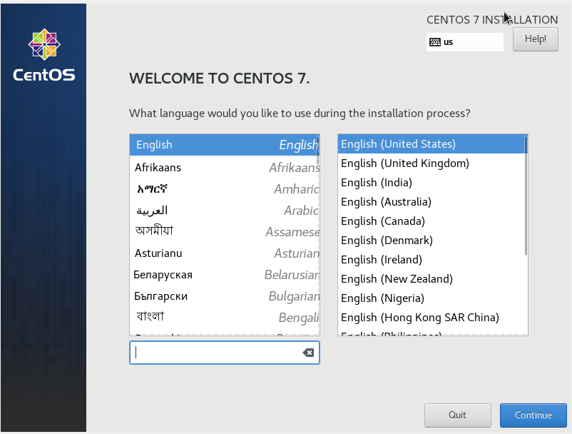
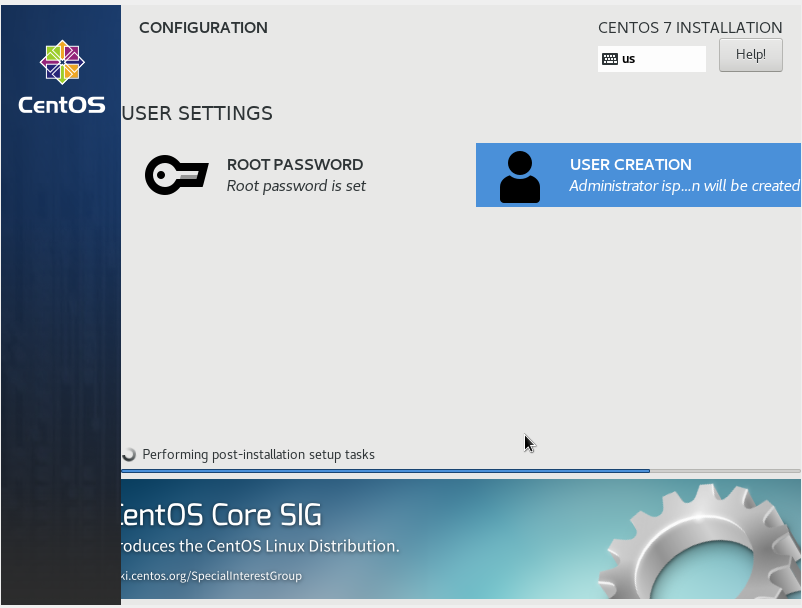
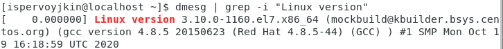
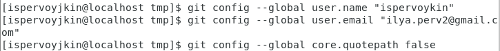
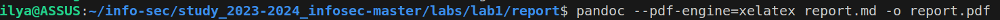
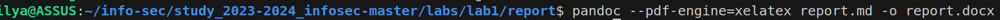

---
## Front matter
lang: ru-RU
title: Отчёт по лабораторной работе №1
author: Первойкин Илья Сергеевич
institute: РУДН, Москва, Россия

date: 9 Сентября 2023

## Formatting
mainfont: PT Serif
romanfont: PT Serif
sansfont: PT Sans
monofont: PT Mono
toc: false
slide_level: 2
theme: metropolis
header-includes:
 - '\metroset{progressbar=frametitle,sectionpage=progressbar,numbering=fraction}'
 - '\makeatletter'
 - '\beamer@ignorenonframefalse'
 - '\makeatother'
aspectratio: 43
section-titles: true
---

# Отчет по лабораторной работе №1

## Выбор языков в виртуальной машине

{ #fig:001 width=70% }

## Установка виртуальной машины

{ #fig:002 width=70% }

## Работа с виртуальной машиной (Домашняя работа №1)
 
- На данном слайде представлено одно из заданий Домашней работы к лабораторной работе №1

{ #fig:003 width=70% }

## Основные команды git

- На данном скриншоте представлены команды git, которые позволяют конфигурировать git на компьютере

{ #fig:004 width=70% }

## Работа с Markdown

- На данных скриншотах представлены команды, которые позволяют преобразовать файл .markdown в файлы .pdf и .docx соответственно

{ #fig:005 width=70% }

{ #fig:006 width=70% }

## Выводы

- Установил VirtualBox, изучил её работу. 
- Изучил идеологию и научился применять средства контроля версий. 
- Научился работать с Markdown-файлами.
- Научился создавать pdf и docx файлы из файла Markdown (с помощью команды make);