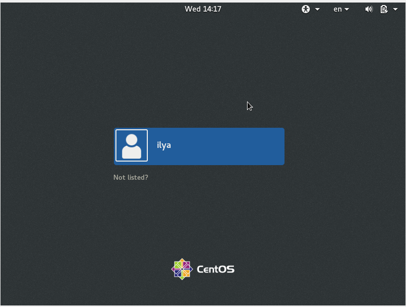
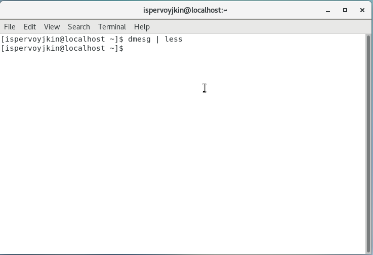
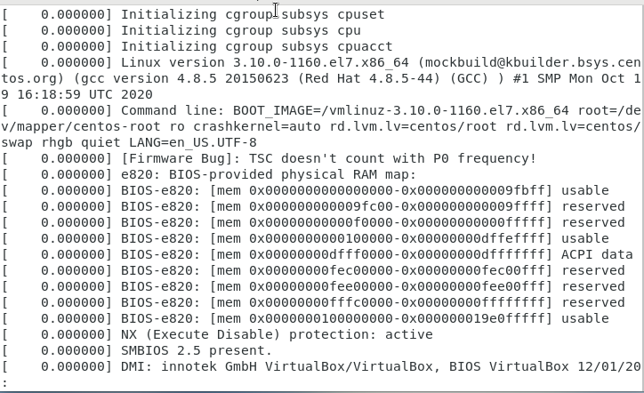
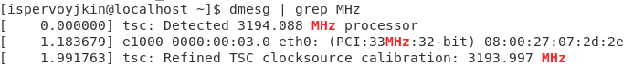
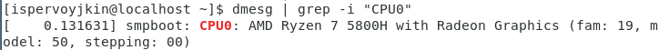
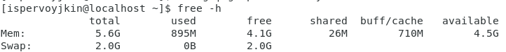
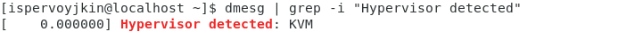
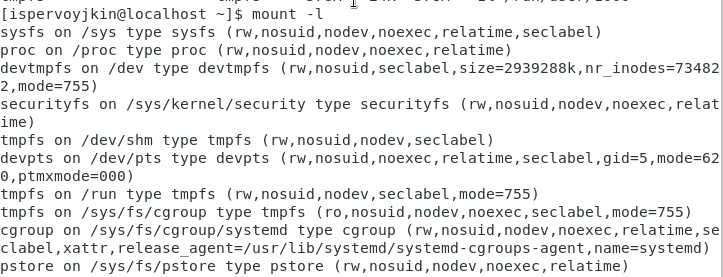
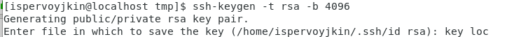
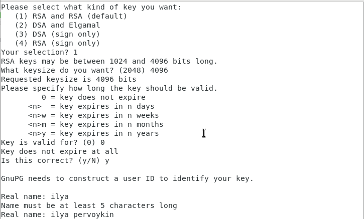

---
# Front matter
lang: ru-RU
title: "Лабораторная работа №1"
subtitle: "Дисциплина: Основы информационной безопасности"
author: "Первойкин Илья Сергеевич"

# Formatting
toc-title: "Содержание"
toc: true # Table of contents
toc_depth: 2
lof: true # List of figures
lot: true # List of tables
fontsize: 12pt
linestretch: 1.5
papersize: a4paper
documentclass: scrreprt
polyglossia-lang: russian
polyglossia-otherlangs: english
mainfont: PT Serif
romanfont: PT Serif
sansfont: PT Sans
monofont: PT Mono
mainfontoptions: Ligatures=TeX
romanfontoptions: Ligatures=TeX
sansfontoptions: Ligatures=TeX,Scale=MatchLowercase
monofontoptions: Scale=MatchLowercase
indent: true
pdf-engine: xelatex
header-includes:
  - \linepenalty=10 # the penalty added to the badness of each line within a paragraph (no associated penalty node) Increasing the value makes tex try to have fewer lines in the paragraph.
  - \interlinepenalty=0 # value of the penalty (node) added after each line of a paragraph.
  - \hyphenpenalty=50 # the penalty for line breaking at an automatically inserted hyphen
  - \exhyphenpenalty=50 # the penalty for line breaking at an explicit hyphen
  - \binoppenalty=700 # the penalty for breaking a line at a binary operator
  - \relpenalty=500 # the penalty for breaking a line at a relation
  - \clubpenalty=150 # extra penalty for breaking after first line of a paragraph
  - \widowpenalty=150 # extra penalty for breaking before last line of a paragraph
  - \displaywidowpenalty=50 # extra penalty for breaking before last line before a display math
  - \brokenpenalty=100 # extra penalty for page breaking after a hyphenated line
  - \predisplaypenalty=10000 # penalty for breaking before a display
  - \postdisplaypenalty=0 # penalty for breaking after a display
  - \floatingpenalty = 20000 # penalty for splitting an insertion (can only be split footnote in standard LaTeX)
  - \raggedbottom # or \flushbottom
  - \usepackage{float} # keep figures where there are in the text
  - \floatplacement{figure}{H} # keep figures where there are in the text
---

# Цель работы

Цель данной лабораторной работы --- Изучить идеологию и применение средств контроль версий (Часть 2). Научиться оформлять отчёты с помощью легковесного языка разметки Markdown (Часть 3).

# Задание

Часть 1 (Установка VitrualBox)
1.Установка и настройка Виртуальной машины VirtualBox (ОС Linux)

Часть 2 (Работа с GitHub)
1.Создать базовую конфигурацию для работы с git.
2.Создать ключ SSH.
3.Создать ключ PGP.
4.Настроить подписи git.
5.Зарегистрироваться на GitHub.
6.Создать локальный каталог для выполнения заданий по предмету.

Часть 3 (Создание Markdown файла)
1.Сделайте отчёт по предыдущей лабораторной работе в формате Markdown.
2.В качестве отчёта предоставить отчёты в 3 форматах: pdf,docx и md

# Выполнение лабораторной работы

Часть 1. Установка и настройка Виртуальной машины VirtualBox

1). Для создания виртуальной машины используем программу Oracle VM VirtualBox. Для начала нужно настроить месторасположение виртуальной машины

2). Создаём виртуальную машину с помощью кнопки “Создать”, вводим имя виртуальной машины и выбираем версию ОС, в данном случае Red Hat (64-bit)

3). Затем устанавливаем объем оперативной памяти — 4096 МБ

4). Создаём новый виртуальный жёсткий диск. А также назначаем размер жёсткого диска — 20 ГБ (но рекомундуют устанавливать - 40 ГБ)

5). Настраиваем виртуальную машину. В разделе “Носители” выбираем новый оптический диск, в данном случае это Rocky-8.6-x86_64-dvd1.iso

6). Запускаем виртуальную машину

Настраиваем язык, я выбрал Английский и русский языки.

{ #fig:001 width=70% }

Настраиваем клавитуру. Добавляем русскую раскладку и делаем смену языка через сочетание клавиш Alt+Shift.

В разделе выбора программ добавляем в качестве дополнения Средства разработки.

Устанавливаем пароль для root и администратора. Создаём пользователя с правами администратора. Дожидаемся загрузки.

{ #fig:002 width=70% }

Перезапускаем виртуальную машину. Дожидаемся загрузки системы.

{ #fig:003 width=70% }

Открываем консоль. Через неё устанавливаем имя хоста командой hostnamectl.

ДОМАШНЕЕ ЗАДАНИЕ №1:

1). Дождался загрузки графического окружения и открыл терминал. В окне
терминала проанализировал последовательность загрузки системы, выполнив
команду dmesg. Можно просто просмотреть вывод этой команды: dmesg | less

{ #fig:004 width=70% }

{ #fig:005 width=70% }

Можно использовать поиск с помощью grep:dmesg | grep -i"то, что ищем"
a. Версия ядра Linux (Linux version).

{ #fig:006 width=70% }

b. Частота процессора (Detected Mhz processor).

{ #fig:007 width=70% }

c. Модель процессора (CPU0)

{ #fig:008 width=70% }

d. Объем доступной оперативной памяти (Memory available)

{ #fig:009 width=70% }

e. Тип обнаруженного гипервизора (Hypervisor detected).

{ #fig:010 width=70% }

f. Тип файловой системы корневого раздела. Последовательность монтирования
файловых систем

{ #fig:011 width=70% }

КОНТРОЛЬНЫЕ ВОПРОСЫ №1

1).Учётная запись пользователя содержит сведения, необходимые для идентификации пользователя при подключении к системе, такие как имя пользователя, имя хоста и пароль.
2).Команды терминала:
   a.Для получения справки используется ключ –help или команда man. Например, ls –help или man ls.
   b.Для перемещения по файловой системе используется команда cd. Например cd ~.
   c.Для просмотра содержимого каталога используется команда ls. Например ls ~/work.
   d.Для определения объёма каталога используется команда du.
   e.Для создания каталогов используется mkdir, для удаления пустых каталогов используется rmdir. Для создания файлов используется touch, для удаления файлов и каталог используется rm.
   f.Для задания прав используется команда chmod. Например, chmod u-w test.txt.
   g.Для просмотра истории команд используется команда history.
3).Файловая система — часть ОС, которая обеспечивает чтение и запись файлов на дисковых носителях информации.
   a.Ext2 — расширенная файловая система. Данные сначала кэшируются и только потом записываются на диск.
   b.Ext3 и Ext4 — журналируемые файловые системы. Осуществляется хранение в виде журнала со списком изменений, что помогает сохранить целостность при сбоях.
   c.XFS — высокопроизводительная журналируемая файловая система, рассчитанная для работы на дисках большого объёма.
4).Для просмотра подмонтированных в ОС файловых систем необходимо использовать команду findmht.
5).Для удаления зависшего процесса используется команда kill PID или killall название.

Часть 2. Работа с GitHub

1). Создаем учетную запись на https://github.com.

2). Настраиваем систему контроля версий git. Синхронизируем учётную запись github с компьютером:
git config --global user.name "Имя Фамилия"
git config --global user.email "work@mail"

{ #fig:012 width=70% }

После этого создаём новый ключ на github (команда ssh-keygen) и привязываем его к компьютеру через консоль.

{ #fig:013 width=70% }

{ #fig:014 width=70% }

{ #fig:015 width=70% }

{ #fig:016 width=70% }

3). Следующим шагом будет создание и подключение репозитория к github. В github заходим в «repository» и создаём новый репозиторий (имя «laboratory»)
Копируем в консоль ссылку на репозиторий (для дальнейшей работы с файлами).

4). В лабораторной работе описан логаритм создания структуры католога через консоль. Но легче будет создать репозиторий в github и после этого работать с каталогом и папками через консоль (перед этим необходимо скопировать ссылку на репозиторий в консоль, в формате https или ssh).
Перед тем, как создавать файлы, заходим в наш репозиторий. После этого можем уже создавать наши файлы.

5). Добавляем первый коммит и выкладываем на github. Для того, чтобы правильно разместить первый коммит, необходимо добавить команду git add ., после этого с помощью команды git commit -am "first commit" выкладываем коммит.

6). Отправляем первый коммит на github, используя команду git push.

7). Первичная конфигурация:
a. Добавляем файл лицензии;

b. Добавим шаблон игнорируемых файлов.Просмотрим список имеющихся шаблонов (на скриншоте список шаблонов представлен не в целом виде):

c. Скачиваем шаблон, например, для C. Также добавляем новые файлы и выполняем коммит:

d. Отправим на github (для этого сохраним все созданные шаблоны и файлы, используя команду git push):

8). Работаем с конфигурацией git-flow (алгоритм к каждому действию представлен на рис. 81-87):
a. Инициализируем git-flow, используя команду git flow init -f (префикс для ярлыков установлен в v)/

b. Проверяем, что мы находимся на ветке develop (используем команду git branch).

c. Создаём релиз с версией 1.0.0.

d. Запишем версию и добавим в индекс:
  echo'hello world'> hello.txt
  git add hello.txt
  git commit -am'Новый файл

e. Заливаем релизную ветку в основную ветку (используем команду git flow release finish1.0.0):

f. Отправляем данные на github:
  git push - -all
  git push - -tags

9). Создаем релиз на github. Для этого заходим в «Releases», нажимаем «Создать новый релиз». Заходим в теги и заполняем все поля (создаём теги для версии 1.0.0). После создания тега, автоматически сформируется релиз.

КОНТРОЛЬНЫЕ ВОПРОСЫ №2:

1). Система контроля версий Git представляетсобой набор программ командной строки.Доступ к ним можно получить изтерминала посредством ввода командыgitс различ-ными опциями. Системы контроля версий (Version Control System,VCS)применяются при работе нескольких человек над одним проектом.

2). В классических системах контроля версий используется централизованная модель, предполагающая наличие единого репозитория для хранения файлов. Выполнение большинства функций по управлению версиями осуществляется специальным сервером.Участник проекта (пользователь) перед началом работы посредством определённыхкоманд получает нужную ему версию файлов. После внесения изменений, пользователь размещает новую версию в хранилище. При этом предыдущие версии не удаляютсяиз центрального хранилища и к ним можно вернуться в любой момент. Сервер может сохранять неполную версию изменённых файлов, а производить так называемую дельта-компрессию—сохранять только изменения между последовательными версиями,чтопозволяет уменьшить объём хранимых данных.
Системы контроля версий также могут обеспечивать дополнительные, более гибкие функциональные возможности. Например,они могут поддерживать работу с нескольки-ми версиями одного файла,сохраняя общую историю изменений до точки ветвления версий и собственные истории изменений каждой ветви. Крометого, обычно доступна информация о том, кто из участников, когда и какие изменения вносил. Обычно такого рода информация хранится в журнале изменений, доступ к которому можно ограничить.

3). Централизованные системы — это системы, которые используют архитектуру клиент / сервер, где один или несколько клиентских узлов напрямую подключены к центральному серверу. Пример - Wikipedia.
В децентрализованных системах каждый узел принимает свое собственное решение. Конечное поведение системы является совокупностью решений отдельных узлов. Пример — Bitcoin.
В классических системах контроля версий используется централизованная модель, предполагающая наличие единого репозитория для хранения файлов.Выполнение большинства функций по управлению версиями осуществляется специальным сервером. 

4). Создадим локальный репозиторий. Сначала сделаем предварительную конфигурацию, указав имя и email владельца репозитория:
git config --global user.name"Имя Фамилия"
git config --global user.email"work@mail"
и настроив utf-8 в выводе сообщенийgit:
git config --global quotepath false
Для инициализации локального репозитория, расположенного, например, в каталоге ~/tutorial, необходимо ввести в командной строке:
cd
mkdir tutorial
cd tutorial
git init

5). Для последующей идентификации пользователя на сервере репозиториев необходимо сгенерировать пару ключей (приватный и открытый):
ssh-keygen -C"Имя Фамилия <work@mail>"
Ключи сохраняться в каталоге~/.ssh/.
Скопировав из локальной консоли ключ в буфер обмена
cat ~/.ssh/id_rsa.pub | xclip -sel clip
вставляем ключ в появившееся на сайте поле.

6). У Git две основных задачи: первая — хранить информацию о всех изменениях в вашем коде, начиная с самой первой строчки, а вторая — обеспечение удобства командной работы над кодом.

7). Основные команды git:
Наиболее часто используемые команды git: – создание основного дерева репозитория:git init–получение обновлений (изменений)текущего дерева из центрального репозитория:git pull–отправка всех произведённых изменений локального дерева в центральный репози-торий:git push–просмотр списка изменённых файлов втекущей директории:git status–просмотртекущих изменения:git diff–сохранениетекущих изменений:–добавить все изменённые и/или созданные файлы и/или каталоги:git add .–добавить конкретные изменённые и/или созданные файлы и/или каталоги:git add имена_файлов – удалить файл и/или каталог из индекса репозитория (приэтомфайл и/илик аталог остаётся в локальной директории): git rm имена_файлов – сохранение добавленных изменений: – сохранить все добавленные изменения и все изменённые файлы: git commit -am 'Описание коммита'–сохранить добавленные изменения с внесением комментария через встроенный редактор:git commit–создание новой ветки, базирующейся натекущей: git checkout -b имя_ветки–переключение на некоторую ветку: git checkout имя_ветки (при переключении на ветку, которой ещё нет в локальном репозитории, она будет создана и связана с удалённой) – отправка изменений конкретной ветки в центральный репозиторий: git push origin имя_ветки–слияние ветки стекущим деревом:git merge --no-ff имя_ветки–удаление ветки: – удаление локальной уже слитой с основным деревом ветки:git branch -d имя_ветки–принудительное удаление локальной ветки:git branch -D имя_ветки–удаление ветки с центрального репозитория: git push origin :имя_ветки

8). Использования git при работе с локальными репозиториями (добавления текстового документа в локальный репозиторий):
git add hello.txt
git commit -am'Новый файл

9). Проблемы, которые решают ветки git:
    • нужно постоянно создавать архивы с рабочим кодом 
    • сложно "переключаться" между архивами 
    • сложно перетаскивать изменения между архивами 
    • легко что-то напутать или потерять

10). Во время работы над проектомтак или иначе могутсоздаваться файлы,которые нетребуется добавлять в последствии в репозиторий. Например, временные файлы, со-здаваемые редакторами,или объектные файлы, создаваемые компиляторами.Можно прописать шаблоны игнорируемых при добавлении в репозиторийтипов файлов в файл.gitignore с помощьюс ервисов. Для этого сначала нужно получить списоки меющихся шаблонов: curl -L -s https://www.gitignore.io/api/list
Затем скачать шаблон,например, для C и C++ 
curl -L -s https://www.gitignore.io/api/c >> .gitignore
curl -L -s https://www.gitignore.io/api/c++ >> .gitignore

Часть 3. Создание Markdown файла
В качестве подтверждения выполнения данной части лабораторной работы я прикрепляю отчёт в трёх форматах (docx, pdf, md). А также презентации в двух форматах (pdf, md).

# Выводы

Установил VirtualBox, изучил её работу. Изучил идеологию и научился пременять средства контроля версий. Научился работать с Markdown-файлами.