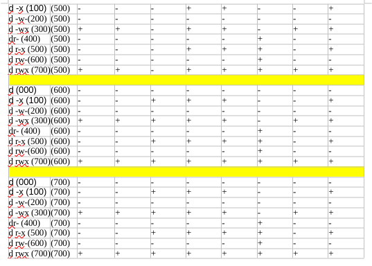

---
# Front matter
lang: ru-RU
title: "Лабораторная работа №2"
subtitle: "Дисциплина: Операционные системы"
author: "Первойкин Илья Сергеевич"

# Formatting
toc-title: "Содержание"
toc: true # Table of contents
toc_depth: 2
lof: true # List of figures
lot: true # List of tables
fontsize: 12pt
linestretch: 1.5
papersize: a4paper
documentclass: scrreprt
polyglossia-lang: russian
polyglossia-otherlangs: english
mainfont: PT Serif
romanfont: PT Serif
sansfont: PT Sans
monofont: PT Mono
mainfontoptions: Ligatures=TeX
romanfontoptions: Ligatures=TeX
sansfontoptions: Ligatures=TeX,Scale=MatchLowercase
monofontoptions: Scale=MatchLowercase
indent: true
pdf-engine: lualatex
header-includes:
  - \linepenalty=10 # the penalty added to the badness of each line within a paragraph (no associated penalty node) Increasing the value makes tex try to have fewer lines in the paragraph.
  - \interlinepenalty=0 # value of the penalty (node) added after each line of a paragraph.
  - \hyphenpenalty=50 # the penalty for line breaking at an automatically inserted hyphen
  - \exhyphenpenalty=50 # the penalty for line breaking at an explicit hyphen
  - \binoppenalty=700 # the penalty for breaking a line at a binary operator
  - \relpenalty=500 # the penalty for breaking a line at a relation
  - \clubpenalty=150 # extra penalty for breaking after first line of a paragraph
  - \widowpenalty=150 # extra penalty for breaking before last line of a paragraph
  - \displaywidowpenalty=50 # extra penalty for breaking before last line before a display math
  - \brokenpenalty=100 # extra penalty for page breaking after a hyphenated line
  - \predisplaypenalty=10000 # penalty for breaking before a display
  - \postdisplaypenalty=0 # penalty for breaking after a display
  - \floatingpenalty = 20000 # penalty for splitting an insertion (can only be split footnote in standard LaTeX)
  - \raggedbottom # or \flushbottom
  - \usepackage{float} # keep figures where there are in the text
  - \floatplacement{figure}{H} # keep figures where there are in the text
---

# Цель работы

Цель данной лабораторной работы - получить практические навыки работы в консоли с атрибутами файлов, закрепить теоретические основы дискреционного разграничения доступа в современных системах с открытым кодом на базе ОС Linux.

# Теоретические данные

Рассмотрим три параметра доступа для каждого файла в ОС Linux:

1.Чтение - разрешить доступ к получению содержимого файла, но записывать нельзя. Для каталога позволяет получить список файлов и каталогов, которые в нём располагаются;

2.Запись - разрешить записывать данные в файл или изменять уже имеющиеся. Также можно создавать и менять файлы и каталоги;

3.Выполнение - нельзя выполнить программу, если у неё нет флага выполнения. Этот атрибут устанавливается для всех программ и скриптов, именно с помощью него система понимает, что этот файл нужно запустить как программу.

Атрибуты --- это набор основных девяти битов, определяющих какие из пользователей обладают правами на чтение, запись
и исполнение. 
Первые три бита отвечают права доступа владельца, вторые --- для группы пользователей, последние --- для всех остальных
пользователей в системе.

Установка атрибутов производится командой chmod. Установка бита чтения (r) позволяет сделать файл доступным для чтения. 
Наличие бита записи (w) позволяет изменять файл. Установка бита запуска (x) позволяет запускать файл на исполнение.

# Задание

1.Создать нового пользователя в Виртуальной машине, установить для него пароль.
2.Заполнить таблицу «Установленные права и разрешённые действия».
3.На основании предыдущей заполненной таблицы определить те или иные минимально необходимые права для выполнения операций внутри директории. Заполнить таблицу «Минимальные права для совершения операций».

# Выполнение лабораторной работы

1). Создал нового пользователя guest командой useradd, затем устанавил для него пароль с помощью команды passwd guest.

{ #fig:001 width=70% }

2). Зашёл в систему от имени пользователя guest, используя только что придуманный пароль. 

{ #fig:002 width=70% }

3). Выполнил команду pwd, которая показывает, что мы находимся в домашнем каталоге пользователя guest. Уточнил имя пользователя командой whoami, ожидаемо получаем вывод guest. 

{ #fig:003 width=70% }

4). C помощью команды id узнал, что uid = 1001, gid = 1001 (guest), а также ввёл команду groups и убедился, что группа состоит из одного пользователя guest. 

{ #fig:004 width=70% }

5). В содержимом файла /etc/passwd нашёл информацию о пользователе, что соответствует данным, полученным с помощью команды id и pwd.

{ #fig:005 width=70% }

{ #fig:006 width=70% }

6). Определил содержимое каталога /home. С помощью команды ls -l /home/ я убедился, что у меня есть домашние директории с их атрибутами rwx в первом бите для каждой. С помощью команды lsattr /home рассмотрел расширенные атрибуты текущего пользователя.

Список поддиректорий директории получить удалось. На директориях установлены права чтения, записи и выполнения для пользователя (для группы и остальных пользователей никаких прав доступа нет).
Удалось увидеть расширенные атрибуты только директории того пользователя, от имени которого я нахожусь в системе.

{ #fig:007 width=70% }

7). Далее создал новый каталог dir1 и увидел, что у него больше атрибутов по сравнению со стандартными директориями.

{ #fig:008 width=70% }

8). Поменял директории dir1 атрибуты с помощью команды chmod 000. Далее, при попытке создать файл, выводится сообщение об ошибке, т.к. забрали права на всё у всех пользователей. Файл, соответственно, также не создаётся.

{ #fig:009 width=70% }

9). Рассмотрим, как влияют различные комбинации атрибутов файлов и директории на различные действия. Для этого буду создадим файл "test", запишем в него командой echo >, прочитаем файл командой cat, поменяем директорию командой cd, просмотрим директорию командой ls, а также переименуем файл командой rename и поменяем атрибуты командой chattr.

{ #fig:010 width=70% }

Таблица «Установленные права и разрешённые действия».

{ #fig:011 width=70% }

{ #fig:012 width=70% }

10). Таблица «Минимальные права для совершения операций».

{ #fig:013 width=70% }

# Выводы

Получил практические навыки работы в консоли с атрибутами файлов, закрепил теоретические основы дискреционного разграничения доступа в современных системах с открытым кодом на базе ОС Linux.

# Библиография

СПИСОК ЛИТЕРАТУРЫ

1.Медведовский И.Д., Семьянов П.В., Платонов В.В. Атака через Internet. — НПО "Мир и семья-95",  1997. — URL: http://bugtraq.ru/library/books/attack1/index.html

2.Теоеретические знания, приведённые в Лабораторной работе №2 - https://esystem.rudn.ru/pluginfile.php/2090123/mod_resource/content/6/002-lab_discret_attr.pdf

3.Запечников С. В. и др. Информационн~пасность открытых систем. Том 1. — М.: Горячаая линия -Телеком, 2006.

СПИСОК ИНТЕРНЕТ-ИСТОЧНИКОВ

1.[Электронный ресурс] - доступ: https://codeby.school/blog/informacionnaya-bezopasnost/razgranichenie-dostupa-v-linux-znakomstvo-s-astra-linux

2.[Электронный ресурс] - доступ: https://debianinstall.ru/diskretsionnoe-razgranichenie-dostupa-linux/