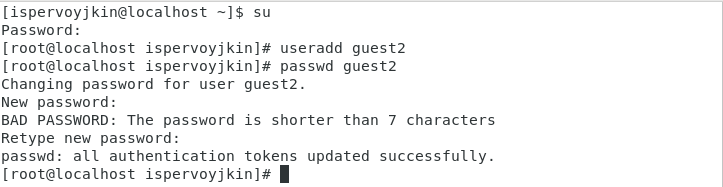
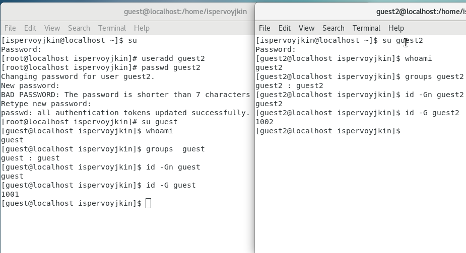
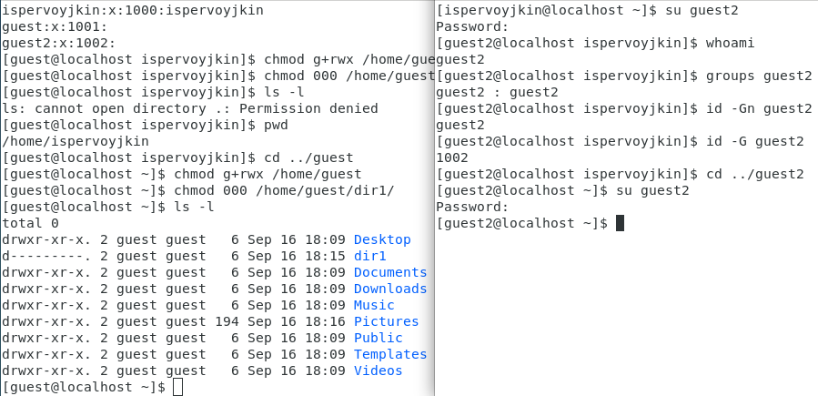
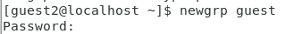
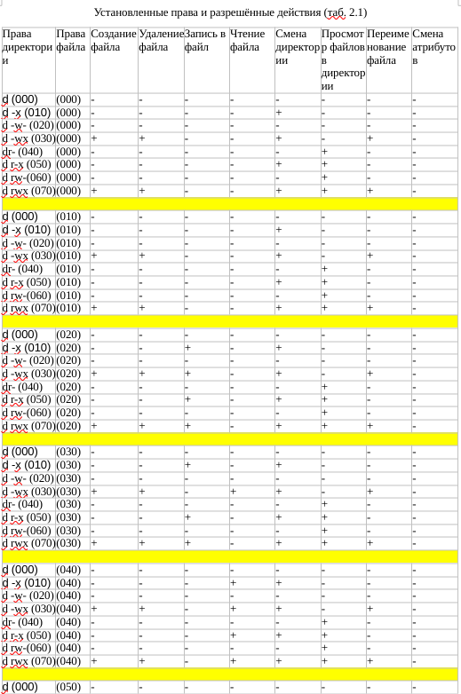
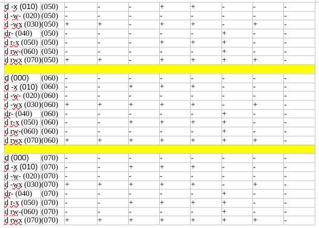
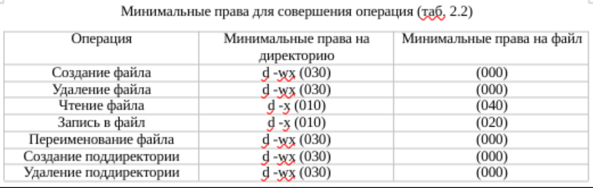

---
## Front matter
lang: ru-RU
title: Презентация по лабораторной работе №3
author: Первойкин Илья Сергеевич
institute: РУДН, Москва, Россия

date: 23 Сентября 2023

## Formatting
toc: false
slide_level: 2
theme: metropolis
header-includes: 
 - \metroset{progressbar=frametitle,sectionpage=progressbar,numbering=fraction}
 - '\makeatletter'
 - '\beamer@ignorenonframefalse'
 - '\makeatother'
aspectratio: 43
section-titles: true
polyglossia-lang: russian
polyglossia-otherlangs: english
mainfont: PT Serif
romanfont: PT Serif
sansfont: PT Sans
monofont: PT Mono
mainfontoptions: Ligatures=TeX
romanfontoptions: Ligatures=TeX
sansfontoptions: Ligatures=TeX,Scale=MatchLowercase
monofontoptions: Scale=MatchLowercase
indent: true
pdf-engine: xelatex
header-includes:
  - \linepenalty=10 # the penalty added to the badness of each line within a paragraph (no associated penalty node) Increasing the value makes tex try to have fewer lines in the paragraph.
  - \interlinepenalty=0 # value of the penalty (node) added after each line of a paragraph.
  - \hyphenpenalty=50 # the penalty for line breaking at an automatically inserted hyphen
  - \exhyphenpenalty=50 # the penalty for line breaking at an explicit hyphen
  - \binoppenalty=700 # the penalty for breaking a line at a binary operator
  - \relpenalty=500 # the penalty for breaking a line at a relation
  - \clubpenalty=150 # extra penalty for breaking after first line of a paragraph
  - \widowpenalty=150 # extra penalty for breaking before last line of a paragraph
  - \displaywidowpenalty=50 # extra penalty for breaking before last line before a display math
  - \brokenpenalty=100 # extra penalty for page breaking after a hyphenated line
  - \predisplaypenalty=10000 # penalty for breaking before a display
  - \postdisplaypenalty=0 # penalty for breaking after a display
  - \floatingpenalty = 20000 # penalty for splitting an insertion (can only be split footnote in standard LaTeX)
  - \raggedbottom # or \flushbottom
  - \usepackage{float} # keep figures where there are in the text
  - \floatplacement{figure}{H} # keep figures where there are in the text
---

# Презентация по лабораторной работе №3

## Цель лабораторной работы №3

Цель: Получить практические навыки работы в консоли с атрибутами файлов для групп пользователей.

# Ход выполнения лабораторной работы

## Создание нового пользователя в виртуальной машине

Создал нового пользователя guest командой useradd, затем установил для него пароль с помощью команды passwd guest.

{ #fig:001 width=70% }

## Создание группы пользователей

 C помощью команды id узнал uid пользователя и группы, в которых он состоит.

{ #fig:002 width=70% }

## Регистрация пользователя в группе 

От имени пользователя guest2 выполнил регистрацию пользователя в группе командой newgrp. 

{ #fig:005 width=70% }

## Смена прав доступа

- Смена основных атрибутов осуществляется с помощью команды chmod.
- Проверка атрибутов осуществляется командой ls -l. 

{ #fig:006 width=70% }

## Разрешённые действия

Изучая все атрибуты, я составил таблицу 3.1 «Установленные права и разрешённые действия».

{ #fig:007 width=70% }

## Разрешённые действия

{ #fig:008 width=70% }

## Минимальные требования

На основании этой таблицы я заполнил вторую таблицу «Минимальные права для совершения операций». В данной таблице указал минимальные требования на права и директорию для выполнения тех или иных действий. Все данные я внёс в таблицу.

{ #fig:009 width=70% }

## Выводы

- Приобрёл практические навыки по работе с атрибутами файлов и директорий в группах пользователей в консоли;
- Изучил и нашёл минимальные права доступа, необходимые для работы с файлами и директориями и группами пользователей.

## Библиография

СПИСОК ЛИТЕРАТУРЫ

1.Медведовский И.Д., Семьянов П.В., Платонов В.В. Атака через Internet. — НПО "Мир и семья-95",  1997. — URL: http://bugtraq.ru/library/books/attack1/index.html

3.Запечников С. В. и др. Информационн~пасность открытых систем. Том 1. — М.: Горячаая линия -Телеком, 2006.

СПИСОК ИНТЕРНЕТ-ИСТОЧНИКОВ

2.[Электронный ресурс] - доступ: https://debianinstall.ru/diskretsionnoe-razgranichenie-dostupa-linux/