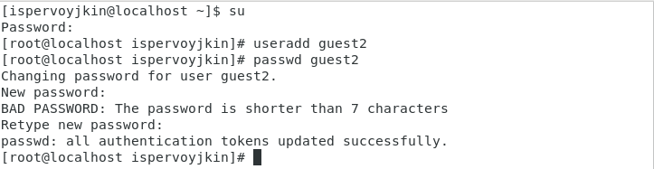

---
# Front matter
lang: ru-RU
title: "Лабораторная работа №3"
subtitle: "Дисциплина: Основы информационной безопасности"
author: "Первойкин Илья Сергеевич"

# Formatting
toc-title: "Содержание"
toc: true # Table of contents
toc_depth: 2
lof: true # List of figures
lot: true # List of tables
fontsize: 12pt
linestretch: 1.5
papersize: a4paper
documentclass: scrreprt
polyglossia-lang: russian
polyglossia-otherlangs: english
mainfont: PT Serif
romanfont: PT Serif
sansfont: PT Sans
monofont: PT Mono
mainfontoptions: Ligatures=TeX
romanfontoptions: Ligatures=TeX
sansfontoptions: Ligatures=TeX,Scale=MatchLowercase
monofontoptions: Scale=MatchLowercase
indent: true
pdf-engine: xelatex
header-includes:
  - \linepenalty=10 # the penalty added to the badness of each line within a paragraph (no associated penalty node) Increasing the value makes tex try to have fewer lines in the paragraph.
  - \interlinepenalty=0 # value of the penalty (node) added after each line of a paragraph.
  - \hyphenpenalty=50 # the penalty for line breaking at an automatically inserted hyphen
  - \exhyphenpenalty=50 # the penalty for line breaking at an explicit hyphen
  - \binoppenalty=700 # the penalty for breaking a line at a binary operator
  - \relpenalty=500 # the penalty for breaking a line at a relation
  - \clubpenalty=150 # extra penalty for breaking after first line of a paragraph
  - \widowpenalty=150 # extra penalty for breaking before last line of a paragraph
  - \displaywidowpenalty=50 # extra penalty for breaking before last line before a display math
  - \brokenpenalty=100 # extra penalty for page breaking after a hyphenated line
  - \predisplaypenalty=10000 # penalty for breaking before a display
  - \postdisplaypenalty=0 # penalty for breaking after a display
  - \floatingpenalty = 20000 # penalty for splitting an insertion (can only be split footnote in standard LaTeX)
  - \raggedbottom # or \flushbottom
  - \usepackage{float} # keep figures where there are in the text
  - \floatplacement{figure}{H} # keep figures where there are in the text
---

# Цель работы

Цель данной лабораторной работы --- Получить практические навыки работы в консоли с атрибутами файлов для групп пользователей.

# Теоретические данные

Рассмотрим три параметра доступа для каждого файла в ОС Linux:

1.Чтение - разрешить доступ к получению содержимого файла, но записывать нельзя. Для каталога позволяет получить список файлов и каталогов, которые в нём располагаются;

2.Запись - разрешить записывать данные в файл или изменять уже имеющиеся. Также можно создавать и менять файлы и каталоги;

3.Выполнение - нельзя выполнить программу, если у неё нет флага выполнения. Этот атрибут устанавливается для всех программ и скриптов, именно с помощью него система понимает, что этот файл нужно запустить как программу.

Атрибуты --- это набор основных девяти битов, определяющих какие из пользователей обладают правами на чтение, запись
и исполнение. 
Первые три бита отвечают права доступа владельца, вторые --- для группы пользователей, последние --- для всех остальных
пользователей в системе.

Установка атрибутов производится командой chmod. Установка бита чтения (r) позволяет сделать файл доступным для чтения. 
Наличие бита записи (w) позволяет изменять файл. Установка бита запуска (x) позволяет запускать файл на исполнение.

В ОС Linux, группа --- это набор пользователей. Основная цель групп --- это определить права на чтение, запись и исполнение
сразу для нескольких пользователей, состоящих в группе. Так же пользователи могут быть добавлены в уже существующие группы для
получения их прав.

Группы бывают двух видов:

- Первичная группа --- это группа, приписанная к файлам, созданным пользователем. Обычно имя первичной группы совпадает с именем
пользователя. У каждого пользователя может быть только одна первичная группа.
- Вторичная группа --- используется для определения прав для набора пользователей. Пользователь может состоять в нескольких вторичных
группах или не состояять ни в одной.

# Задание

1.Создать нового пользователя в Виртуальной машине, установить для него пароль, чтобы можно было работать с двумя пользователями одновременно.
2.Заполнить таблицу «Установленные права и разрешённые действия» (см. табл. 3.1)
3.На основании заполненной таблицы 3.1 определить те или иные минимально необходимые права для выполнения операций внутри директории. Заполнить таблицу «Минимальные права для совершения операций» 3.2.

# Выполнение лабораторной работы

1). Создал нового пользователя guest2 командой useradd, затем установил для него пароль с помощью команды passwd guest2.

{ #fig:001 width=70% }

2). Зашёл в систему от имени пользователей guest и guest2 на двух терминалах, используя команду su - <имя пользователя> и только что установленный пароль. 

Выполнил команду pwd, которая показывает, что мы находимся в соответствующих домашних каталогах пользователей. Уточнил имя пользователя, используя команду whoami, получил вывод guest и guest2 соответственно. Определил группы для каждого пользователя, в которых состоят пользователи командой groups. Пользователь guest состоит только в группе guest, а пользователь guest2 состоит в двух группах --- guest и guest2. Эту же информацию можно узнать с помощью команды id -Gn. 

{ #fig:002 width=70% }

3). В содержимом файла /etc/passwd находим информацию о группах, в которых состоят пользователи, что соответствует данным, полученным с помощью команды id и groups. От имени пользователя guest2 выполнил регистрацию пользователя в группе командой newgrp. 

{ #fig:003 width=70% }

{ #fig:004 width=70% }

{ #fig:005 width=70% }

4). От имени пользователя guest изменил права на директорию /home/guest, чтобы пользователи в группе получили доступ к файлам в домашнем каталоге. Также меняем директории dir1 атрибуты с помощью команды chmod 000. Далее проверяем изменения командой ls -l (рис. [-@fig:006]). 

{ #fig:006 width=70% }

5). Далее решил изучить, как влияют различные комбинации атрибутов файлов и директории на различные действия. Для этого менял атрибуты файлов от имени пользователя guest командой chmod. А от имени пользователя guest2 пытался создать файл командой touch, удалить его командой rm, записать в файл командой echo >, прочитать файл командой cat, сменить директорию командой cd, просмотреть директорию командой ls, переименовать файл командой rename и сменить атрибуты командой chattr .

Все приведённые исследования отмечал в таблице (шаблон представлен в описании выполнения лабораторной работы №3). Успех отмечал +, в случае ошибки доступа записывал - 

Все данные я внёс в таблицу 3.1 «Установленные права и разрешённые действия».

{ #fig:007 width=70% }

{ #fig:008 width=70% }

В сравнении с таблицей из Лабораторной работы №2 мы можем наблюдать, что изменилась только возможность изменять атрибуты файлов. Это связано с тем, что во всех комбинациях стоит 0 в начале, что означает отсутствие прав у владельца файла и директории. Остальные же действия доступны как владельцу, так и членам группы, в равной степени при должной конфигурации прав.

6).На основании этой таблицы я заполнил вторую таблицу (3.2) «Минимальные права для совершения операций». В данной таблице указал минимальные требования на права и директорию для выполнения тех или иных действий. Все данные я внёс в таблицу.

{ #fig:009 width=70% }

# Выводы

Приобрёл практические навыки работы с атрибутами директорий и файлов в группе пользователей через консоль, выяснил минимальные требования и права для совершения различных действий над файлами и директориями.

# Библиография

СПИСОК ЛИТЕРАТУРЫ

1.Медведовский И.Д., Семьянов П.В., Платонов В.В. Атака через Internet. — НПО "Мир и семья-95",  1997. — URL: http://bugtraq.ru/library/books/attack1/index.html

2.Теоеретические знания, приведённые в Лабораторной работе №3 - https://esystem.rudn.ru/pluginfile.php/2090125/mod_resource/content/4/003-lab_discret_2users.pdf

3.Запечников С. В. и др. Информационн~пасность открытых систем. Том 1. — М.: Горячаая линия -Телеком, 2006.

СПИСОК ИНТЕРНЕТ-ИСТОЧНИКОВ

1.[Электронный ресурс] - доступ: https://codeby.school/blog/informacionnaya-bezopasnost/razgranichenie-dostupa-v-linux-znakomstvo-s-astra-linux

2.[Электронный ресурс] - доступ: https://debianinstall.ru/diskretsionnoe-razgranichenie-dostupa-linux/