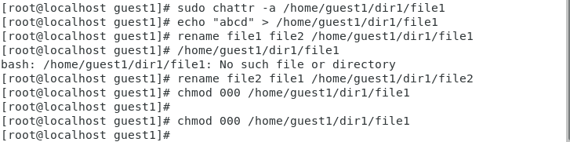

---
# Front matter
lang: ru-RU
title: "Лабораторная работа №4"
subtitle: "Дисциплина: Основы информационной безопасности"
author: "Первойкин Илья Сергеевич"

# Formatting
toc-title: "Содержание"
toc: true # Table of contents
toc_depth: 2
lof: true # List of figures
lot: true # List of tables
fontsize: 12pt
linestretch: 1.5
papersize: a4paper
documentclass: scrreprt
polyglossia-lang: russian
polyglossia-otherlangs: english
mainfont: PT Serif
romanfont: PT Serif
sansfont: PT Sans
monofont: PT Mono
mainfontoptions: Ligatures=TeX
romanfontoptions: Ligatures=TeX
sansfontoptions: Ligatures=TeX,Scale=MatchLowercase
monofontoptions: Scale=MatchLowercase
indent: true
pdf-engine: xelatex
header-includes:
  - \linepenalty=10 # the penalty added to the badness of each line within a paragraph (no associated penalty node) Increasing the value makes tex try to have fewer lines in the paragraph.
  - \interlinepenalty=0 # value of the penalty (node) added after each line of a paragraph.
  - \hyphenpenalty=50 # the penalty for line breaking at an automatically inserted hyphen
  - \exhyphenpenalty=50 # the penalty for line breaking at an explicit hyphen
  - \binoppenalty=700 # the penalty for breaking a line at a binary operator
  - \relpenalty=500 # the penalty for breaking a line at a relation
  - \clubpenalty=150 # extra penalty for breaking after first line of a paragraph
  - \widowpenalty=150 # extra penalty for breaking before last line of a paragraph
  - \displaywidowpenalty=50 # extra penalty for breaking before last line before a display math
  - \brokenpenalty=100 # extra penalty for page breaking after a hyphenated line
  - \predisplaypenalty=10000 # penalty for breaking before a display
  - \postdisplaypenalty=0 # penalty for breaking after a display
  - \floatingpenalty = 20000 # penalty for splitting an insertion (can only be split footnote in standard LaTeX)
  - \raggedbottom # or \flushbottom
  - \usepackage{float} # keep figures where there are in the text
  - \floatplacement{figure}{H} # keep figures where there are in the text
---

# Цель работы

Цель данной лабораторной работы --- Получить навыки работы в консоли с расширенными атрибутами файлов.

# Теоретические данные

Атрибуты --- это набор основных девяти битов, определяющих какие из пользователей обладают правами на чтение, запись
и исполнение. 
Первые три бита отвечают права доступа владельца, вторые --- для группы пользователей, последние --- для всех остальных
пользователей в системе.

Установка атрибутов производится командой chmod. Установка бита чтения (r) позволяет сделать файл доступным для чтения. 
Наличие бита записи (w) позволяет изменять файл. Установка бита запуска (x) позволяет запускать файл на исполнение.

Расширенные атрибуты --- это система дополнительной информации, которая может быть добавлена к файлу или директории в файловой системе.

Некоторые примеры расширенных атрибутов:

- а --- файл можно открыть только в режиме добавления.
- А --- при доступе к файлу его запись atime не изменяется.
- с --- файл автоматически сжимается.
- e --- файл использует экстенты.
- E --- файл, каталог или символьная ссылка зашифрованы файловой системой.
- F --- поиски путей в директории выполняются без учёта регистра.
- i --- файл не может быть изменён.
- m --- файл не сжимается.

Установка атрибутов производится командой chmod. Установка бита чтения (r) позволяет сделать файл доступным для чтения. 
Наличие бита записи (w) позволяет изменять файл. Установка бита запуска (x) позволяет запускать файл на исполнение.

В ОС Linux, группа --- это набор пользователей. Основная цель групп --- это определить права на чтение, запись и исполнение
сразу для нескольких пользователей, состоящих в группе. Так же пользователи могут быть добавлены в уже существующие группы для
получения их прав.

Группы бывают двух видов:

- Первичная группа --- это группа, приписанная к файлам, созданным пользователем. Обычно имя первичной группы совпадает с именем
пользователя. У каждого пользователя может быть только одна первичная группа.
- Вторичная группа --- используется для определения прав для набора пользователей. Пользователь может состоять в нескольких вторичных
группах или не состояять ни в одной.

# Задание

1.Определить расширенные атрибуты файла в Виртуальной машине.
2.Установка расширенного атрибута "a" на файл
3.Снять расширенные атрибуты "a" с файла

# Выполнение лабораторной работы

1). От имени пользователя guest1 просмотрел расширенные атрибуты файла file1 с помощью команды lsattr. 
После этого изменил права на этот файл с помощью команды chmod 600 file1, сделав его доступным только для чтения и записи. 
Далее при попытке добавить расширенный атрибут с помощью команды chattr я получил сообщение об ошибке.

{ #fig:001 width=70% }

2). От имени администратора в другой консоли добавил файлу file1 аттрибут a командой chattr +a. Также убедился в корректном установлении атрибута с помощью команды lsattr.

{ #fig:002 width=70% }

{ #fig:003 width=70% }

3). Дозаписал в конец файла новую информацию с помощью команды echo >> и проверил, что это действительно произошло, используя команду cat. 
После этого попытался стереть информацию в файле с помощью команды echo >, на что получил ошибку. Мне также не удалось переименовать файл и изменить его атрибуты командой chmod из-за той же ошибки в правах доступа.

{ #fig:004 width=70% }

4). Снял расширенный атрибут "a" командой chattr -a от лица администратора. При повторе ранее описанных действий теперь не произошло ошибок и они все выполнились.

{ #fig:005 width=70% }

5). От имени адмистратора добавил файлу расширенный атрибут i и повторил действия, описанные раннее. 
В итоге получил, что в этом случае файл можно только читать, но его нельзя никак изменить.

{ #fig:006 width=70% }

{ #fig:007 width=70% }

# Выводы

Приобрел практические навыки работы с расширенными атрибутами файлов через консоль, опробовал на практике действия с файлами с установленными на них расширенными атрибутами a и i .

# Библиография

СПИСОК ЛИТЕРАТУРЫ

1.Медведовский И.Д., Семьянов П.В., Платонов В.В. Атака через Internet. — НПО "Мир и семья-95",  1997. — URL: http://bugtraq.ru/library/books/attack1/index.html

2.Теоеретические знания, приведённые в Лабораторной работе №4 - https://esystem.rudn.ru/pluginfile.php/2090127/mod_resource/content/3/004-lab_discret_extattr.pdf

3.Запечников С. В. и др. Информационн~пасность открытых систем. Том 1. — М.: Горячаая линия -Телеком, 2006.

СПИСОК ИНТЕРНЕТ-ИСТОЧНИКОВ

1.[Электронный ресурс] - доступ: https://codeby.school/blog/informacionnaya-bezopasnost/razgranichenie-dostupa-v-linux-znakomstvo-s-astra-linux

2.[Электронный ресурс] - доступ: https://debianinstall.ru/diskretsionnoe-razgranichenie-dostupa-linux/